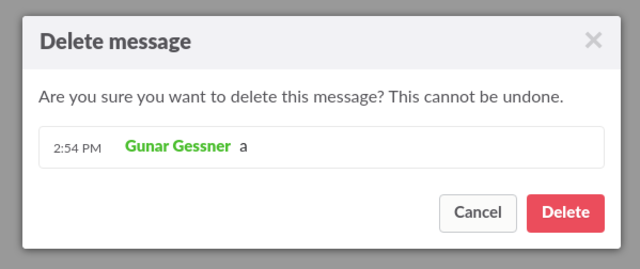

# Slack Easy Delete

In [Slack](https://slack.com/), use `Control+Shift+Space` to delete the message under
the cursor.

The preferred method of installation is through the [Extension](https://chrome.google.com/webstore/detail/aofnbjmngnhhacenlhfdodidiebiicob/) at Google's Webstore.

